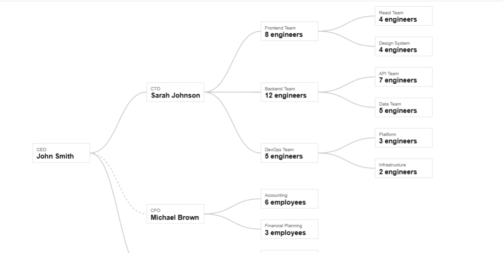

# react-nodes

A React library for building interactive node-based hierarchies and tree visualizations.

## Basic UI Screenshot


## Installation

```bash
npm install react-nodes
```

## Usage

```tsx
import { TreeCanvas } from "react-nodes";

const data = [
  {
        id: "ceo",
        title: "CEO",
        value: "John Smith",
    },

    {
        id: "cto",
        parentId: "ceo",
        title: "CTO",
        value: "Sarah Johnson",
    },
    {
        id: "cfo",
        parentId: "ceo",
        title: "CFO",
        value: "Michael Brown",
    },
];

function App() {
  return <TreeCanvas data={data} />;
}
```

## Features

* React and TypeScript support
* Canvas-based node rendering
* Parent-child hierarchy visualization
* Customizable node rendering
* Pan and zoom support
* Expand and collapse nodes
* Interactive node selection
* Designed for large node hierarchies

## Development

Clone the repository and install dependencies:

```bash
git clone <repository-url>
cd react-nodes
npm install
```

Start the development server:

```bash
npm run dev
```

Build the library:

```bash
npm run build
```

The production build is generated in the `dist` directory.

Start Storybook:

```bash
npm run storybook
```

Build Storybook for deployment:

```bash
npm run build-storybook
```

## Project Structure

```text
react-nodes/
├── src/
│   ├── components/
│   │   └── TreeCanvas/
│   ├── rendering/
│   ├── types/
│   └── index.ts
├── package.json
├── tsconfig.json
├── vite.config.ts
└── README.md
```

## TypeScript

`react-nodes` is written in TypeScript and includes TypeScript declarations with the npm package.

```tsx
import type { TreeNode, TreeCanvasProps } from "react-nodes";
```

## Building

The library is built using Vite and outputs both ESM and CommonJS builds:

```text
dist/
├── react-nodes.js
├── react-nodes.cjs
├── react-nodes.css
└── index.d.ts
```

React and React DOM are treated as peer dependencies and are not bundled into the library.

## License

MIT
