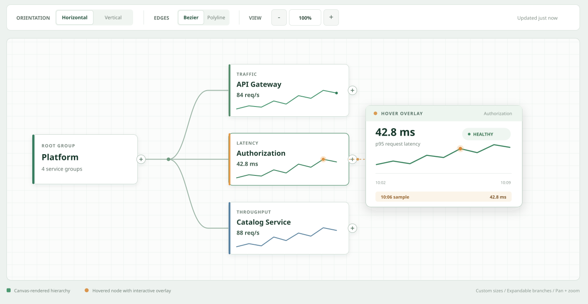

# react-nodes

`react-nodes` is a React and TypeScript library for displaying hierarchical data as an interactive canvas tree. It provides automatic tree layout, horizontal and vertical orientations, expandable branches, node callbacks, pan and zoom controls, and an imperative API for controlling the view.



## Installation

```bash
npm install react-nodes
```

React 18 or newer and React DOM are peer dependencies and should already be installed in your application.

## Quick Start

```tsx
import { TreeCanvas, type TreeNode } from "react-nodes";

const data: TreeNode[] = [
  { id: "company", title: "Company", value: "Northwind" },
  { id: "engineering", parentId: "company", title: "Engineering", value: "24 people" },
  { id: "finance", parentId: "company", title: "Finance", value: "8 people" },
];

export function App() {
  return (
    <div style={{ width: "100%", height: 600 }}>
      <TreeCanvas data={data} />
    </div>
  );
}
```

The canvas fills its `width` and `height` defaults (`100%` each), so its parent needs a measurable size. Nodes without `parentId` are roots. Every non-root `parentId` should match another node's `id`; IDs should be unique.

## Features

- Canvas rendering for hierarchical node data
- Automatic layout in horizontal or vertical orientation
- Expand and collapse controls for nodes with children
- Mouse-wheel zoom, pointer-drag panning, and touch pinch zoom
- Configurable node dimensions, level spacing, and sibling spacing
- Bezier or polyline edges, including dashed edges per child node
- Node click, double-click, and hover callbacks
- Programmatic view and expansion controls through a forwarded ref

## Node Data

| Field | Type | Required | Description |
| --- | --- | --- | --- |
| `id` | `string` | Yes | Unique identifier for the node. |
| `parentId` | `string` | No | ID of the parent node. Omit it for a root node. |
| `title` | `string` | Yes | Short label drawn above the value. |
| `value` | `string` | Yes | Main text drawn inside the node. |
| `lineType` | `"solid" \| "dashed"` | No | Style of the edge connecting this node to its parent. Defaults to `"solid"`. |
| `edgeColor` | `string` | No | CSS canvas color for the edge connecting this node to its parent. Defaults to gray. |
| `width` | `number` | No | Per-node width override; otherwise uses the `nodeWidth` component prop. |
| `height` | `number` | No | Per-node height override; otherwise uses the `nodeHeight` component prop. |
| `type` | `string` | No | Matches the node renderer in `nodeRenderers`; unmatched nodes use the default drawing. |

## Component Props

| Prop | Type | Default | Description |
| --- | --- | --- | --- |
| `data` | `TreeNode[]` | Required | Nodes to display. Roots omit `parentId`; child nodes refer to their parent by ID. |
| `width` | `string` | `"100%"` | CSS width of the canvas. Give the parent a size when using percentages. |
| `height` | `string` | `"100%"` | CSS height of the canvas. Give the parent a size when using percentages. |
| `nodeWidth` | `number` | `150` | Width, in canvas CSS pixels, of every node. |
| `nodeHeight` | `number` | `50` | Height, in canvas CSS pixels, of every node. |
| `levelGap` | `number` | `150` | Distance between adjacent tree levels. |
| `nodeGap` | `number` | `30` | Minimum spacing used between sibling branches. |
| `edgeType` | `"bezier" \| "polyline"` | `"bezier"` | Shape used to connect parent and child nodes. |
| `orientation` | `"horizontal" \| "vertical"` | `"horizontal"` | Direction in which child levels extend. |
| `minZoom` | `number` | `0.2` | Lower zoom bound. Must be greater than zero. |
| `maxZoom` | `number` | `3` | Upper zoom bound; must be greater than or equal to `minZoom`. |
| `initialZoom` | `number` | `1` | Starting zoom, constrained by the zoom bounds. |
| `zoomEnabled` | `boolean` | `true` | Enables mouse-wheel and pinch zoom. |
| `panEnabled` | `boolean` | `true` | Enables pointer-drag movement and touch pointer tracking. |
| `showExpandCollapse` | `boolean` | `true` | Shows the expand/collapse indicators and enables clicking their toggle targets. The imperative expansion methods remain available when hidden. |
| `expandCollapseRenderer` | `ExpandCollapseRendererProps` | — | Custom drawing callback and dimensions for expand/collapse indicators. |
| `onNodeClick` | `(node, event) => void` | — | Called when a node is clicked. A single click is delayed briefly to distinguish it from a double-click. |
| `onDoubleClickNode` | `(node, event) => void` | — | Called when a node is double-clicked. |
| `onHoverNode` | `(node \| null, event) => void` | — | Called when the hovered node changes; receives `null` when the pointer leaves the nodes. |
| `nodeRenderers` | `CustomNodeRendererProps[]` | — | Custom drawing callbacks, selected by matching `TreeNode.type` to a renderer's `type`. A match replaces the default card drawing. |

### Custom Node Drawing

Provide a renderer for nodes whose `type` matches the renderer's `type`. The `draw` callback receives the canvas context and a `DOMRect` containing the node's canvas-space bounds. Node-level `width` and `height` take precedence over the component's `nodeWidth` and `nodeHeight` defaults; the resolved dimensions are available in `rect`.

| Renderer field | Type | Default | Description |
| --- | --- | --- | --- |
| `type` | `string` | Required | Matches `TreeNode.type`. |
| `draw` | `({ ctx, rect }, node) => void` | Required | Draws the custom node in canvas coordinates, replacing the default card drawing. |
| `allowOverlay` | `boolean` | `false` | Opts matching nodes into a DOM overlay while hovered. |
| `overlayRenderer` | `(node) => ReactNode` | — | Returns the React content mounted over the hovered node when `allowOverlay` is `true`. |

### Custom Expand/Collapse Icons

Pass `expandCollapseRenderer` to replace the built-in icon. Its dimensions determine the drawing bounds, clickable area, and reserved space between levels and edges. The callback receives the canvas context, icon `rect`, expanded state, orientation, and node. When omitted, the default 10-by-10 indicator is used.

```tsx
const expandCollapseRenderer: ExpandCollapseRendererProps = {
  width: 18,
  height: 18,
  draw: ({ ctx, rect }, isExpanded, orientation) => {
    ctx.fillStyle = isExpanded ? "#34735b" : "#ffffff";
    ctx.strokeStyle = "#34735b";
    ctx.lineWidth = 2;
    ctx.beginPath();
    ctx.roundRect(rect.x, rect.y, rect.width, rect.height, 5);
    ctx.fill();
    ctx.stroke();

    ctx.strokeStyle = isExpanded ? "#ffffff" : "#34735b";
    ctx.beginPath();
    if (orientation === "horizontal") {
      ctx.moveTo(rect.x + rect.width * 0.4, rect.y + rect.height * 0.25);
      ctx.lineTo(rect.x + rect.width * 0.65, rect.y + rect.height * 0.5);
      ctx.lineTo(rect.x + rect.width * 0.4, rect.y + rect.height * 0.75);
    } else {
      ctx.moveTo(rect.x + rect.width * 0.25, rect.y + rect.height * 0.4);
      ctx.lineTo(rect.x + rect.width * 0.5, rect.y + rect.height * 0.65);
      ctx.lineTo(rect.x + rect.width * 0.75, rect.y + rect.height * 0.4);
    }
    ctx.stroke();
  },
};

<TreeCanvas data={data} expandCollapseRenderer={expandCollapseRenderer} />;
```

```tsx
const nodeRenderers: CustomNodeRendererProps[] = [
  {
    type: "status",
    draw: ({ ctx, rect }, node) => {
      ctx.fillStyle = "#e4f2eb";
      ctx.fillRect(rect.x, rect.y, rect.width, rect.height);
      ctx.fillStyle = "#173d2e";
      ctx.fillText(node.title, rect.x + 10, rect.y + 20);
      ctx.fillText(node.value, rect.x + 10, rect.y + 40);
    },
  },
];

const data: TreeNode[] = [
  { id: "healthy", title: "Service", value: "Healthy", type: "status", width: 180, height: 64 },
];

<TreeCanvas data={data} nodeRenderers={nodeRenderers} />;
```

The custom `draw` callback replaces the default card and text drawing; built-in expand/collapse indicators are still drawn for parent nodes when enabled. The main exported types are `TreeNode`, `TreeCanvasProps`, `TreeCanvasHandle`, and `CustomNodeRendererProps`.

Set `allowOverlay: true` and provide `overlayRenderer` to mount a React overlay over the matching custom node while it is hovered. The overlay follows the node as the tree pans, zooms, or relayouts, and is removed from the DOM when the pointer leaves the node. Custom-rendered nodes have no hover delay; the default hover delay remains for built-in nodes. Keep overlays lightweight for large trees.

The callback event arguments are React mouse events for the canvas. The canvas uses CSS-pixel coordinates for layout and view movement.

## Imperative Ref

Use `TreeCanvasHandle` to control the tree from a parent component:

```tsx
import { useRef } from "react";
import { TreeCanvas, type TreeCanvasHandle, type TreeNode } from "react-nodes";

const data: TreeNode[] = [
  { id: "root", title: "Root", value: "Overview" },
  { id: "child", parentId: "root", title: "Child", value: "Details" },
];

export function TreeWithControls() {
  const treeRef = useRef<TreeCanvasHandle>(null);

  return (
    <>
      <button onClick={() => treeRef.current?.centerNode("root")}>
        Center root
      </button>
      <div style={{ height: 500 }}>
        <TreeCanvas ref={treeRef} data={data} />
      </div>
    </>
  );
}
```

| Method | Argument | Description |
| --- | --- | --- |
| `zoomTo(zoom)` | `number` | Set zoom, constrained by `minZoom` and `maxZoom`. |
| `zoomIn(step?)` | `step?: number` (default `0.1`) | Increase zoom by `step`, respecting `maxZoom`. |
| `zoomOut(step?)` | `step?: number` (default `0.1`) | Decrease zoom by `step`, respecting `minZoom`. |
| `moveTo(x, y)` | `number, number` | Set the canvas viewport translation. |
| `moveBy(dx, dy)` | `number, number` | Move the viewport by a relative offset. |
| `centerNode(nodeId)` | `string` | Center a node in the visible canvas. Does nothing if the node is not laid out. |
| `expand(nodeId)` | `string` | Expand a node's children. |
| `collapse(nodeId)` | `string` | Collapse a node's children. |
| `toggle(nodeId)` | `string` | Toggle a node's expanded state. |
| `expandAll()` | — | Expand every node in the current data. |
| `collapseAll()` | — | Collapse all nodes. |
| `refresh()` | — | Recalculate and redraw the tree. |

## Layout and Interaction

Nodes are expanded by default. Clicking a node's expand/collapse control preserves its approximate screen position. When the `data` prop changes, removed IDs are removed from expansion state and newly added nodes start expanded.

Pointer dragging pans the view when `panEnabled` is on. Mouse-wheel and pinch zoom are independently controlled by `zoomEnabled`; zoom operations respect the configured bounds. The imperative `moveTo` and `moveBy` values are viewport offsets in canvas CSS pixels.

## TypeScript

The package includes TypeScript declarations. The main exported types are `TreeNode`, `TreeCanvasProps`, `TreeCanvasHandle`, `CustomNodeRendererProps`, and `ExpandCollapseRendererProps`:

```tsx
import type { CustomNodeRendererProps, ExpandCollapseRendererProps, TreeCanvasHandle, TreeCanvasProps, TreeNode } from "react-nodes";
```

## Development

```bash
npm install
npm run dev
npm run storybook
```

Build the package or the static Storybook site with:

```bash
npm run build
npm run build-storybook
```

The package build writes ESM, CommonJS, and declaration outputs to `dist/`. Storybook examples are available at [react-nodes Storybook](https://karthickbg.github.io/react-nodes/).

## License

MIT